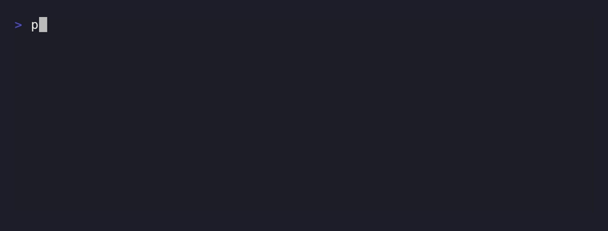

# qsoku

*[日本語](README_ja.md) | **English***

<div align="center">


**One set of shortcuts, shared by the whole team.**

[](https://github.com/amisonnet8/qsoku/actions/workflows/ci.yml)
[](https://github.com/amisonnet8/qsoku/releases)
[](LICENSE)
[](go.mod)
[](https://pkg.go.dev/github.com/amisonnet8/qsoku)

<a href="#features">Features</a> ·
<a href="#demo">Demo</a> ·
<a href="#example">Example</a> ·
<a href="#install">Install</a> ·
<a href="#learn-more">Learn more</a>

</div>

> **Early days (v0.1.0).** The `qsokufile` format and the command line may still
> change without notice in a future release. `go install ...@latest` currently
> resolves to `v0.1.0`.

**qsoku** writes a repository's own command shortcuts into a `qsokufile`, so
anyone (or anything) in that repository can run `qsoku <name>` from
anywhere inside it.

## Features

- 🔗 **Shortcuts that live in the repository** — unlike a shell `alias`, a
  `qsokufile` is committed with the repository, so the whole team gets the
  same shortcuts, and they never leak into your other projects.
- 🧭 **The same name from anywhere** — qsoku walks up from the current
  directory to find the one `qsokufile` in use, the same way git finds
  `.git/`.
- 🐚 **Always runs with `sh`** — a `qsokufile` command means the same thing
  no matter which shell you typed `qsoku` from, and `cd`s inside it bring
  your working directory back automatically.
- 🧩 **Only three rules of its own** — how qsoku finds the `qsokufile`, what
  `//` means, and how it brings the working directory back. Everything else
  is ordinary `sh`.
- 🤖 **Works for AI agents too** — the `qsokufile` is the repository's own
  list of commands, so a human and an AI agent can run the same shortcut by
  the same name.

## Demo

<div align="center">
  
</div>

Recorded against this very repository: `qsoku test` is `(cd //; go test ./...)`,
run from `internal/cli/` — `//` always finds its way back to the root, no
matter where you call it from.

## Example

<!-- qsoku:example dir=tour -->
```
$ qsoku build
building the project
$ qsoku test
testing from /home/you/project
```

```
# qsokufile
build: echo "building the project"
test: (cd //; echo "testing from $QSOKU_ROOT")
```

`test` uses `//` to reach the repository root — from `qsoku build` you get the
same shortcut whether you run it from the repository root or three
directories down.

## Install

```sh
go install github.com/amisonnet8/qsoku/cmd/qsoku@latest
```

Then add one line to your shell's startup file (see
[cli.md](docs/reference/cli.md#shell-integration) for bash/zsh/fish
specifics):

```sh
eval "$(qsoku .shell bash)"
```

This also wires up shell completion for the names in your `qsokufile`.

<details>
<summary>Adding a shortcut, start to finish (click to expand)</summary>

<!-- qsoku:example dir=none -->
```
$ qsoku .init
Created /home/you/project/qsokufile
$ qsoku .add build 'echo "building the project"'
$ qsoku .add hello 'echo "hello, $1"'
$ qsoku .list
build: echo "building the project"
hello: echo "hello, $1"
```

See [docs/tour/](docs/tour/) for a longer, hands-on walk-through.

</details>

## Learn more

- [Interactive guide](https://notebook.google.com/notebook/7ae8788d-2942-4c0c-a1cf-6587cec9428e) —
  ask questions about qsoku and explore it conversationally (built with
  Gemini/NotebookLM)
- [docs/tour/](docs/tour/) — a hands-on walk through qsoku, from an empty
  `qsokufile` to shell integration and completion
- [docs/reference/](docs/reference/) — the formal specification of the
  `qsokufile` format and the `qsoku` command line
- [docs/examples/](docs/examples/) — `qsokufile`s you can copy into your own
  repository

## License

MIT (see [LICENSE](LICENSE)).

---

<p align="center">
  <a href="docs/tour/">docs/tour/</a> ·
  <a href="docs/reference/">docs/reference/</a> ·
  <a href="docs/examples/">docs/examples/</a> ·
  <a href="LICENSE">LICENSE</a>
</p>
