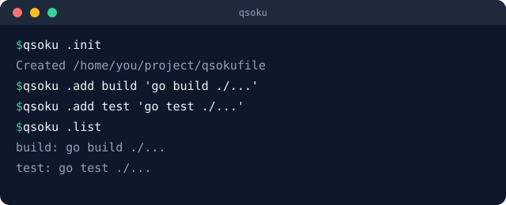

# qsoku

*[English](README.md) | **日本語***

<div align="center">


**チーム全員が、同じコマンドの近道を。**

[](https://github.com/amisonnet8/qsoku/actions/workflows/ci.yml)
[](https://github.com/amisonnet8/qsoku/releases)
[](LICENSE)
[](go.mod)
[](https://pkg.go.dev/github.com/amisonnet8/qsoku)

<a href="#特徴">特徴</a> ·
<a href="#デモ">デモ</a> ·
<a href="#例">例</a> ·
<a href="#インストール">インストール</a> ·
<a href="#もっと知る">もっと知る</a>

</div>

> **開発の初期段階です（v0.1.0）。** `qsokufile`の書式やコマンドは、今後のリリースで
> 予告なく変わることがあります。`go install ...@latest`は今`v0.1.0`を指します。

**qsoku**は、リポジトリ固有のコマンドの近道を`qsokufile`に書いておくツール。
そのリポジトリのどこにいても（人間でもAIでも）`qsoku <名前>`で呼べる。

## 特徴

- 🔗 **リポジトリに残る近道** — シェルの`alias`と違い、`qsokufile`はリポジトリと
  一緒にコミットされる。チーム全員が同じ近道を使え、ほかのプロジェクトに
  漏れ出すこともない
- 🧭 **どこからでも同じ名前** — カレントディレクトリから親へたどって見つかる、
  1つの`qsokufile`がリポジトリのどこからでも使われる（gitの`.git/`と同じ探し方）
- 🐚 **実行は常に`sh`** — `qsoku`をどのシェルから打っても、`qsokufile`のコマンドは
  同じ意味で動く。`cd`を含む近道でも、居場所は自動で持ち帰る
- 🧩 **独自ルールは3つだけ** — `qsokufile`の探し方・`//`の意味・居場所の持ち帰り。
  残りはすべて普通の`sh`の知識で書ける
- 🤖 **AIエージェントにも効く** — `qsokufile`がそのリポジトリのコマンド一覧になり、
  人間とAIエージェントが同じ名前で同じ近道を呼べる

## デモ

<div align="center">
  
</div>

## 例

<!-- qsoku:example dir=basic -->
```
$ qsoku hello world
hello, world
```

```
# qsokufile
hello: echo "hello, $1"
```

## インストール

```sh
go install github.com/amisonnet8/qsoku/cmd/qsoku@latest
```

シェルの起動ファイルに1行足す（bash・zsh・fishそれぞれの詳細は
[cli_ja.md](docs/reference/cli_ja.md#シェル連携)を参照）：

```sh
eval "$(qsoku .shell bash)"
```

これで、`qsokufile`に定義した名前のシェル補完も一緒に有効になる。

<details>
<summary>近道を足す一連の流れ（クリックで展開）</summary>

<!-- qsoku:example dir=none -->
```
$ qsoku .init
Created /home/you/project/qsokufile
$ qsoku .add build 'echo "building the project"'
$ qsoku .add hello 'echo "hello, $1"'
$ qsoku .list
build: echo "building the project"
hello: echo "hello, $1"
```

手を動かしながらの詳しい入門は[docs/tour/](docs/tour/)を参照。

</details>

## もっと知る

- [docs/tour/](docs/tour/) — 空の`qsokufile`からシェル連携・補完までを
  手を動かしながら追う入門
- [docs/reference/](docs/reference/) — `qsokufile`の書式と`qsoku`
  コマンドラインの正式な仕様
- [docs/examples/](docs/examples/) — 自分のリポジトリにコピーして使える
  `qsokufile`の実例

## ライセンス

MIT（[LICENSE](LICENSE)参照）。

---

<p align="center">
  <a href="docs/tour/">docs/tour/</a> ·
  <a href="docs/reference/">docs/reference/</a> ·
  <a href="docs/examples/">docs/examples/</a> ·
  <a href="LICENSE">LICENSE</a>
</p>
